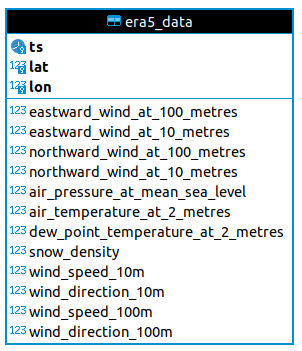

# Udacity Data Engineering Capstone 
A backend of weather measurements and forecast datasets for a climate analisys or a service/website like [wind-prospector](https://maps.nrel.gov/wind-prospector/)


## Datasets: ERA5

Planet OS is working in conjunction with the AWS Public Dataset Program to publish and maintain regular updates of ERA5 data in S3. ERA5 Climate reanalysis provides a numerical assessment of the modern climate. It is produced by a similar process as regular numerical weather forecast, a data assimilation and forecast loop, taking into account most of the available meteorological observations and analyses them with state of the art numerical model, producing a continuous, spatially consistent and homogeneous dataset.
Data is currently available starting 1979 and is updated monthly. As ECMWF is moving towards more frequent data updates


### Datasets Overview

<table>
  <tr>
    <td>Source</td>
    <td><a href="http://apps.ecmwf.int/data-catalogues/era5/">ECMWF WebAPI</a></td>
  </tr>
  <tr>
    <td>Category</td>
    <td>Climate Reanalysis</td>
  </tr>
  <tr>
    <td>Format</td>
    <td>NetCDF</td>
  </tr>
  <tr>
    <td>License</td>
    <td>Generated using Copernicus Climate Change Service Information 2018. See <a href="http://apps.ecmwf.int/datasets/licences/copernicus/">http://apps.ecmwf.int/datasets/licences/copernicus/</a> for additional information.</td>
  </tr>
  <tr>
    <td>Storage</td>
    <td>Amazon S3</td>
  </tr>
  <tr>
    <td>Location</td>
    <td><strong>Amazon Resource Name (ARN)</strong><br/>arn:aws:s3:::era5-pds<br/><br/>
        <strong>AWS Region</strong><br/>us-east-1<br/><br/>
        <strong>URL</strong><br/><a href="http://era5-pds.s3.amazonaws.com/">http://era5-pds.s3.amazonaws.com/</a>
    </td>
  </tr>
  <tr>
    <td>Update Frequency</td>
    <td>New data is published monthly. The ERA5 Public Release Plan is available at <a href="http://climate.copernicus.eu/products/climate-reanalysis">http://climate.copernicus.eu/products/climate-reanalysis</a></td>
  </tr>
</table>


The data is structured as follows:

```
/{year}/{month}/main.nc
               /data/{var1}.nc
                    /{var2}.nc
                    /{....}.nc
                    /{varN}.nc
```

## Chosen Datasets

### Snow density
 - Units: kg m-3
 - Description: This parameter is the mass of snow per cubic metre in the snow layer.
 - Documentation: https://apps.ecmwf.int/codes/grib/param-db?id=33
### Mean sea level pressure
 - Units: Pa
 - Description: This parameter is the pressure (force per unit area) of the atmosphere adjusted to the height of mean sea level
 - Documentation: https://apps.ecmwf.int/codes/grib/param-db?id=151
### 2 metre dewpoint temperature
 - Units: K
 - Description: This parameter is the temperature to which the air, at 2 metres above the surface of the Earth, would have to be cooled for saturation to occur.
 - Documentation: https://apps.ecmwf.int/codes/grib/param-db?id=168
### V component of wind (Northward Wind)
 - Units: m s-1
 - Description: This parameter is the northward component of the wind. It is the horizontal speed of air moving towards the north, in metres per second. A negative sign thus indicates air movement towards the south.
 - Documentation: https://apps.ecmwf.int/codes/grib/param-db?id=132
### U component of wind (Eastward Wind)
 - Units: m s-1
 - Description: This parameter is the eastward component of the wind. It is the horizontal speed of air moving towards the east, in metres per second. A negative sign thus indicates air movement towards the west
 - Documentation: https://apps.ecmwf.int/codes/grib/param-db?id=131
### 2 metre temperature
 - Units: K
 - Description: This parameter is the temperature of air at 2m above the surface of land, sea or in-land waters.
 - Documentation: https://apps.ecmwf.int/codes/grib/param-db?id=167

## More info on all data types [here](https://confluence.ecmwf.int/rest/ecmwfjsd/1.0/exporthtml/pagedisplay/CKB/ERA5%3A+data+documentation) and also [here](https://apps.ecmwf.int/codes/grib/)

### Wind Speed (Calculated)
 - Units: m s-1
 - Description: Horizontal wind speed. Calculated using `V component of wind` and `U component of wind` 
 - Documentation: https://disc.gsfc.nasa.gov/information/data-in-action?title=Derive%20Wind%20Speed%20and%20Direction%20With%20MERRA-2%20Wind%20Components

### Wind Direction (Calculated)
 - Units: m s-1
 - Description: Horizontal wind direction. Calculated using `V component of wind` and `U component of wind` 
 - Documentation: https://disc.gsfc.nasa.gov/information/data-in-action?title=Derive%20Wind%20Speed%20and%20Direction%20With%20MERRA-2%20Wind%20Components


## Data Model

In order to optimize analytics queries, there is a single table where all data is stored, each dataset above is a column.
Index added to the timestamp, latitude and longitude colums.
Because the data is very large and time oriented the main table is partitioned by year.



Staging data goes to the 'staging' schema and the final data to the schema 'db'.

## ETL


 - Task checks if data for the respective dag run is available
 - Xarray files are downloaded from S3 using the Boto3 library
 - Using bulting feature of xarray to filter, by coordinates, and convert chunks of data into Pandas Dataframes
 - Using the COPY pgsql command to stage data (much faster than multiline inserts)
 - Data quality check are made against the staged data
 - Wind direction and Wind speed are calculated from V and U wind components
 - Staged data is joined and added to the final table
 - Other dataquality checks are made


# Addressing Other Scenarios

## The data was increased by 100x.
Data would need to be further partitioned. Horizontal partitioning, and more vertical partitions, would be straightforward to implement. 
Redshift would be a good fit since the data can be easily partitioned

## The pipelines would be run on a daily basis by 7 am every day.
No problem, already took this in consideration. New data would just be updated or appended.

## The database needed to be accessed by 100+ people.
A couple of Redshift nodes could handle that.


## Tech choices:

### PostgreSQL
- Easier migration to Redshift if needed.
- I want to challenge myself since I'm very proficient in SQL Server

### Airflow
- It is made in python, good integration with the other tools required.
- Backfills and retries are a must
- It's one of the best ETL platform.
- I'm already very familiar with Airflow.


## Environment configuration

### Requirements

- Anaconda
- An active Amazon AWS Account
- Docker
- Docker Compose
- Ubuntu 20.04+ (Also tested under WSL, works fine.)

### Conda
- Navigate to the project folder
- Create the environment: `conda env create -f environment.yml`
- Activate the new environment: `conda activate capstone`

### Database setup
- Create a new config file named **environment.sh** using the template config file **environment.sh.template**
- Fill the env variables in **environment.sh** according to your environment.
- Load the environment variables `source environment.sh`
- Create the Postgres container `docker-compose up`
- Connect to Postgres and create the database, schema and tables:
```sql
CREATE DATABASE weatherdb;
```
```sql
CREATE SCHEMA db;
```
```sql
CREATE SCHEMA staging;
```
```sql
CREATE TABLE db.era5_data (
    ts timestamp NULL,
    lat float8 NULL,
    lon float8 NULL,
    eastward_wind_at_100_metres float4 NULL,
    eastward_wind_at_10_metres float4 NULL,
    northward_wind_at_100_metres float4 NULL,
    northward_wind_at_10_metres float4 NULL,
    air_pressure_at_mean_sea_level float4 NULL,
    air_temperature_at_2_metres float4 NULL,
    dew_point_temperature_at_2_metres float4 NULL,
    snow_density float4 NULL,
    wind_speed_10m float4 NULL,
    wind_direction_10m float4 NULL,
    wind_speed_100m float4 NULL,
    wind_direction_100m float4 NULL,
    CONSTRAINT pk_era5_data PRIMARY KEY ("ts", "lat", "lon")
) PARTITION BY RANGE ("ts");

CREATE TABLE era5_data_y1949_1987 PARTITION OF era5_data
    FOR VALUES FROM ('1949-01-01 00:00:00') TO ('1987-12-31 23:59:59');
CREATE TABLE era5_data_y1988_y1995 PARTITION OF era5_data
    FOR VALUES FROM ('1988-01-01 00:00:00') TO ('1995-12-31 23:59:59');
CREATE TABLE era5_data_y1996_2003 PARTITION OF era5_data
    FOR VALUES FROM ('1996-01-01 00:00:00') TO ('2003-12-31 23:59:59');
CREATE TABLE era5_data_y2004_2011 PARTITION OF era5_data
    FOR VALUES FROM ('2004-01-01 00:00:00') TO ('2011-12-31 23:59:59');
CREATE TABLE era5_data_y2012_2019 PARTITION OF era5_data
    FOR VALUES FROM ('2012-01-01 00:00:00') TO ('2019-12-31 23:59:59');
CREATE TABLE era5_data_y2020_2029 PARTITION OF era5_data
    FOR VALUES FROM ('2020-01-01 00:00:00') TO ('2029-12-31 23:59:59');
```

### Airflow
- Make sure you have:
  - Loaded the environment variables `source environment.sh`
  - Started the database container `docker-compose start`
  - Activated the conda environment `conda activate capstone`
- Check the oficial Airflow docs: https://airflow.apache.org/docs/apache-airflow/stable/installation.html#getting-airflow
- Install airflow 1.10.14
```shell
AIRFLOW_VERSION=1.10.14
PYTHON_VERSION="$(python --version | cut -d " " -f 2 | cut -d "." -f 1-2)"
CONSTRAINT_URL="https://raw.githubusercontent.com/apache/airflow/constraints-${AIRFLOW_VERSION}/constraints-${PYTHON_VERSION}.txt"

pip install "apache-airflow==${AIRFLOW_VERSION}" --constraint "${CONSTRAINT_URL}"

pip install apache-airflow["postgres"]
pip install apache-airflow["s3"]

airflow db init
```
- Start airflow running the script `./start.sh`
- Stop airflow killing the processes `pkill -f airflow`

DISCLAIMER: This setup NOT is suited for production! Check out the Airflow [documentation](https://airflow.apache.org/docs/apache-airflow/stable/best-practices.html) for best practices
